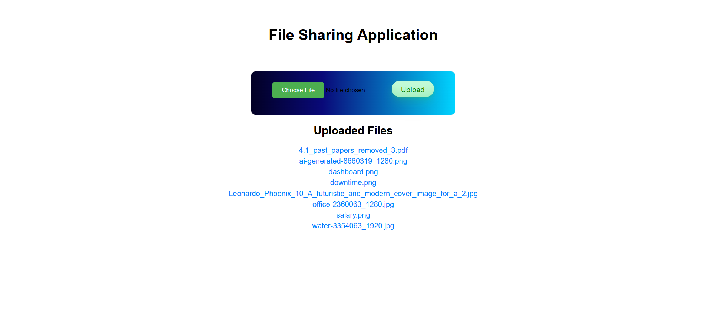

# Flask File Upload Application

This is a simple Flask web application that allows users to upload files, view a list of previously uploaded files, and download them using different devices with same router. The app supports a variety of file types including images, PDFs, and text documents.

## Features
- Upload files through a simple form.
- View a list of previously uploaded files.
- Download uploaded files directly from the web interface.
- Handle errors like invalid file types or file size limits.
- Flash messages for successful uploads and error notifications.

## Technologies Used
- **Flask**: A lightweight WSGI web application framework for Python.
- **HTML/CSS**: For the frontend interface.

## Prerequisites
Before running the app, make sure you have the following installed:
- Python 3.x
- Flask

## Check your firewall settings
Make sure the firewall on the machine running the Flask app allows inbound connections on port 5000.

